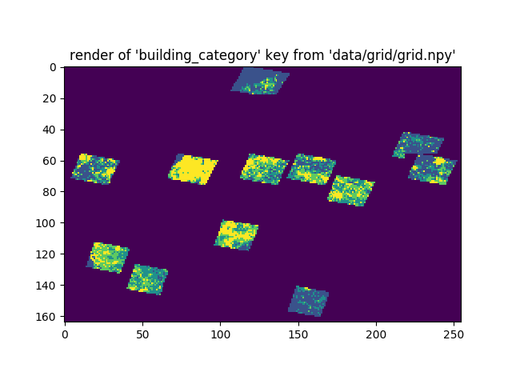

# Modeling the Relationship between Landsat Imagery and OpenStreetMap Data

## Summary
For this project, I took massive Landsat images of Europe and building counts from OpenStreetMap (OSM) in the areas covered by those images. After sorting OSM building counts into four buckets corresponding to increasing levels of civilization, I trained a TensorFlow neural network on some areas known to be thoroughly mapped in OpenStreetMap. I then used the trained model to predict the ideal OSM building count based on an input of corresponding Landsat imagery.

## Further Reading
Here's a post I wrote about the process I went through to prepare the geo-referenced imagery for this project: https://www.nathanwyand.com/2019/08/04/processing-satellite-imagery-for-deep-learning/

## Run this Project
1. To use this library, begin by creating a directory called 'data'. Inside this directory, create the following folders:
* 'grid'
* 'source'
* 'reproject'
* 'tiles'
* 'prepared'
* 'train'
* 'validate'
* 'test'
2. Download several GeoTIF files from https://glovis.usgs.gov/ and place them in the 'source' folder.
3. Open the file 'process.py'. Be sure that all functions, with the exception of utilities, are uncommented. 
4. After the initial run, be careful re-running grid.create() as it will overwrite stored data.
5. On later runs, check function docstrings to see which functions are necessary to run again. 
